Исходные данные:\
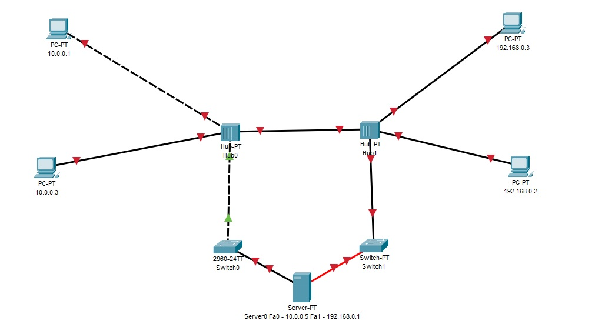
1. PC 10.0.0.1
Включаю порт и меняю кабель:\
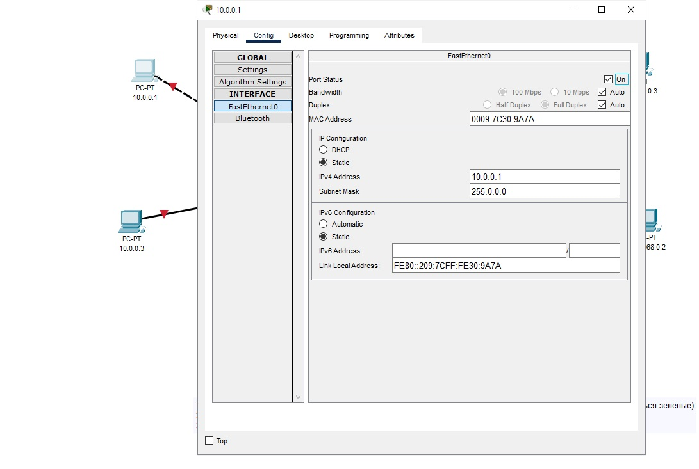
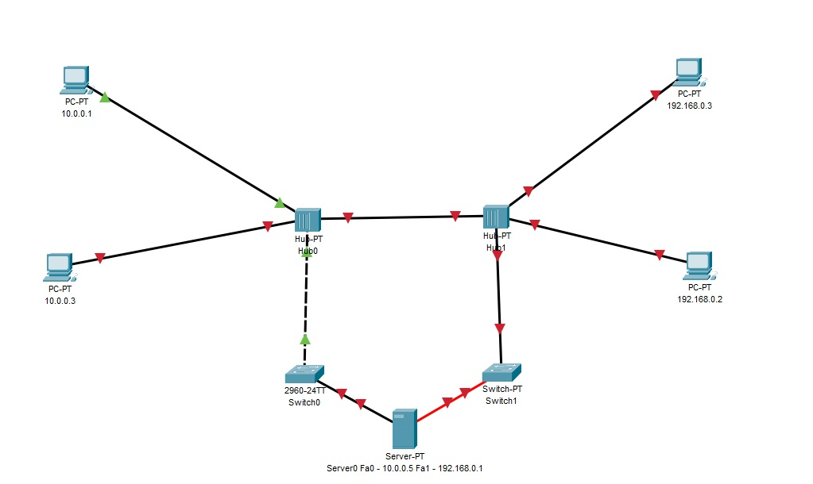
2. PC 10.0.0.3
Прописываю IP, Mask и выставляю автоматический выбор скорости и дуплекса:\
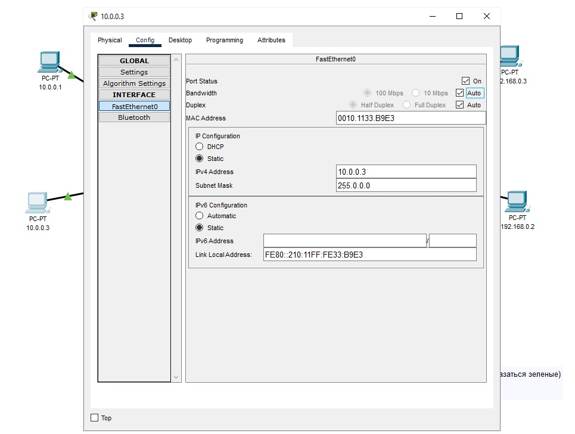
3. PC 192.168.0.3
Прописываю IP, Mask и выставляю автоматический выбор скорости и дуплекса:\
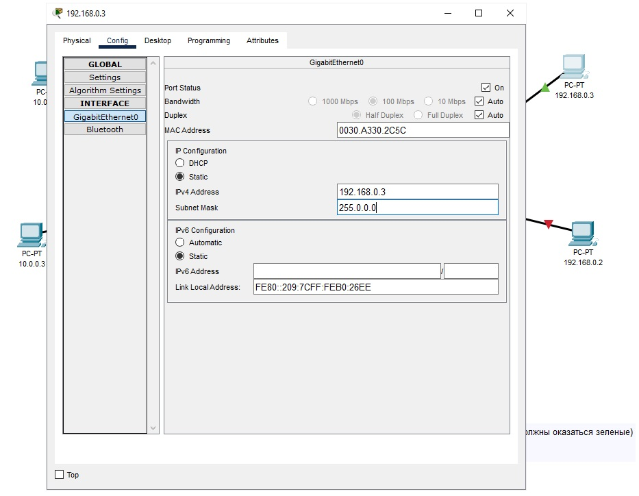
4. PC 192.168.0.2
Прописываю IP, Mask и включаю порт:\
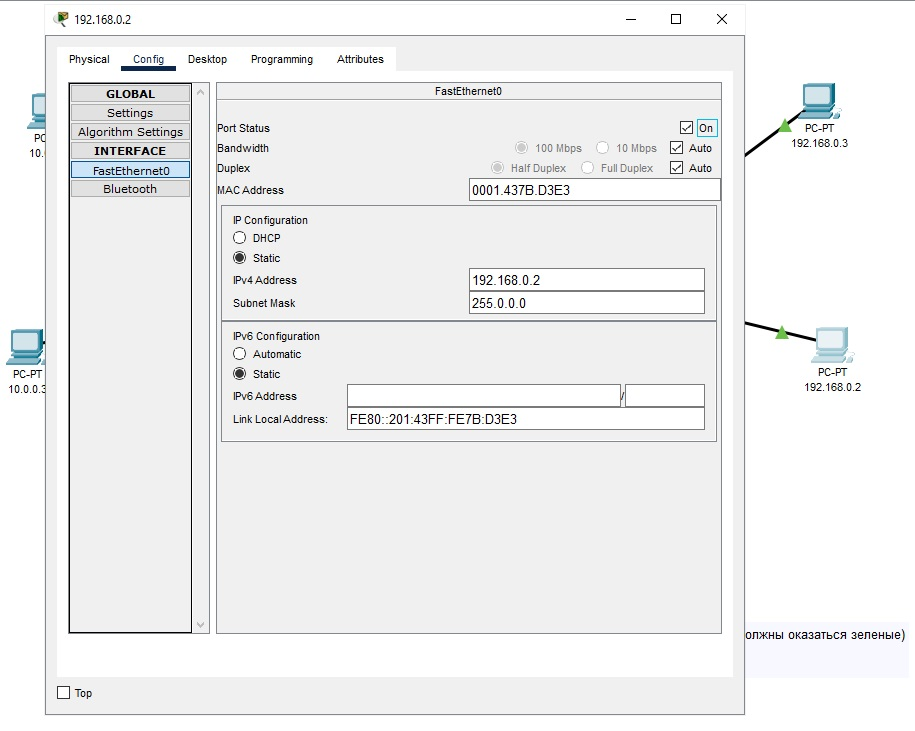
5. HUB0-HUB1 и HUB1-Switch1:\
Меняю кабель на Cross-Over\
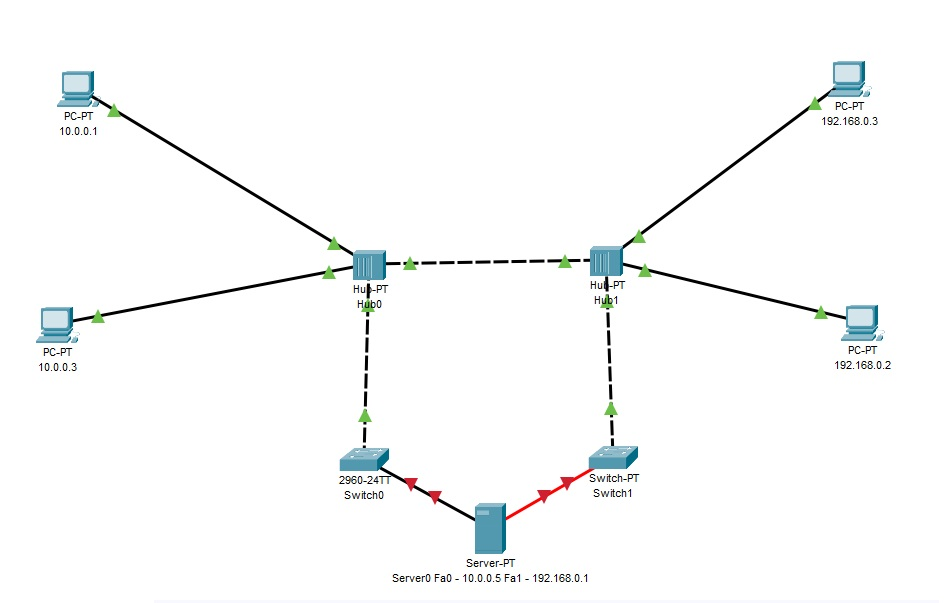
6. Server:
FastEthernet0 - Прописываю IP, Mask и выставляю автоматический выбор скорости и дуплекса:\
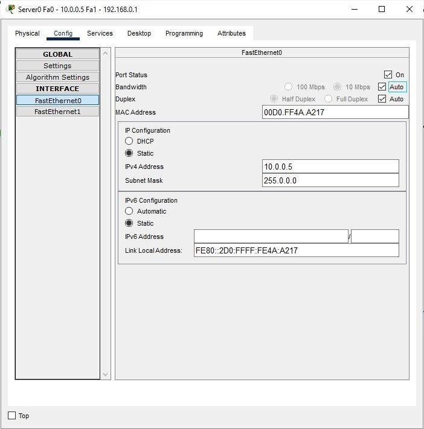\
FastEthernet1 - меняю сетевую на 1CFE, прописываю IP, Mask, включаю порт и меняю кабель:\
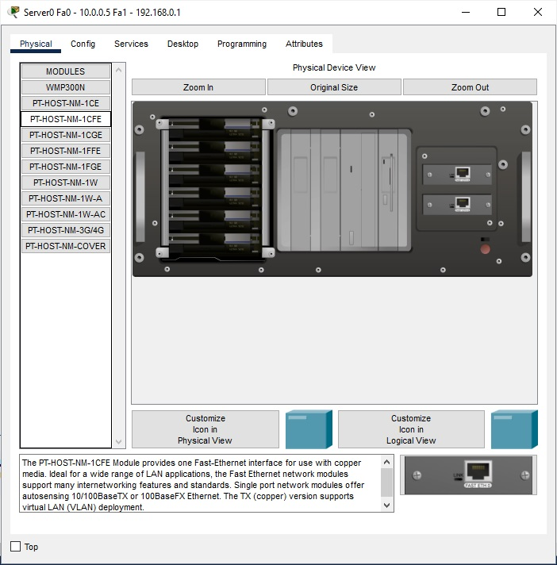
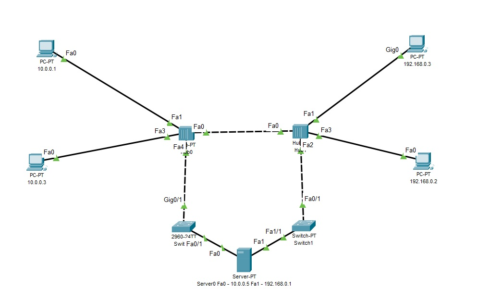
7. ping До двух PC разных подсетей:\
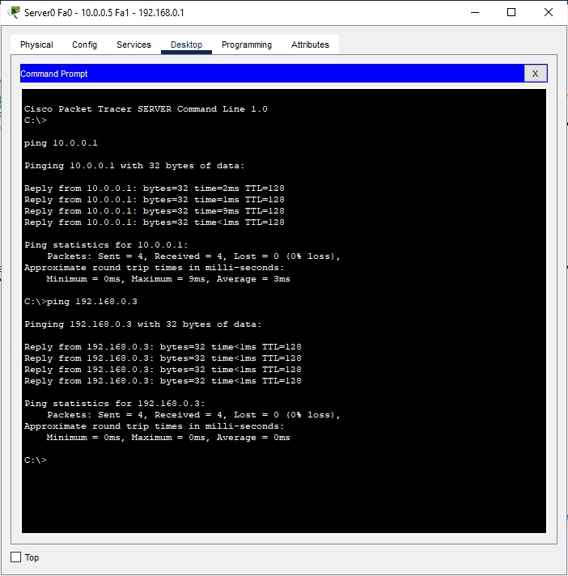
